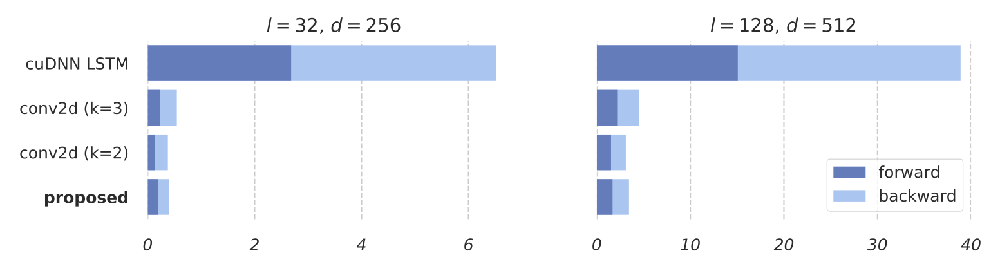

### Latest

[@musyoku](https://github.com/musyoku) had a very nice [SRU implementaion](https://github.com/musyoku/chainer-sru) in chainer, where he reports 30x speed-up over LSTM in some cases! 

Check the speed comparison he did [here](https://raw.githubusercontent.com/musyoku/images/master/sru/pytorch-vs-chainer-lstm.png).

<br>

## About

**SRU** is a recurrent unit that can run over 10 times faster than cuDNN LSTM, without loss of accuracy tested on many tasks. 
<p align="center">
<br>
<i>Average processing time of LSTM, conv2d and SRU, tested on GTX 1070</i><br>
</p>
For example, the figure above presents the processing time of a single mini-batch of 32 samples. SRU achieves 10 to 16 times speed-up compared to LSTM, and operates as fast as (or faster than) word-level convolution using conv2d. 

#### Reference:
[Training RNNs as Fast as CNNs](https://arxiv.org/abs/1709.02755)
```
@article{lei2017sru,
  title={Training RNNs as Fast as CNNs},
  author={Lei, Tao and Zhang, Yu},
  journal={arXiv preprint arXiv:1709.02755},
  year={2017}
}
```
<br>

## Requirements
 - **GPU and CUDA 8 are required**
 - [PyTorch](http://pytorch.org/)
 - [CuPy](https://cupy.chainer.org/)
 - [pynvrtc](https://github.com/NVIDIA/pynvrtc)
 
Install requirements via `pip install -r requirements.txt`. CuPy and pynvrtc needed to compile the CUDA code into a callable function at runtime. Only single GPU training is supported. 

<br>

## Examples
The usage of SRU is similar to `nn.LSTM`. SRU likely requires more stacking layers than LSTM. We recommend starting by 2 layers and use more if necessary (see our report for more experimental details).
```python
import torch
from torch.autograd import Variable
from cuda_functional import SRU, SRUCell

# input has length 20, batch size 32 and dimension 128
x = Variable(torch.FloatTensor(20, 32, 128).cuda())

input_size, hidden_size = 128, 128

rnn = SRU(input_size, hidden_size,
    num_layers = 2,          # number of stacking RNN layers
    dropout = 0.0,           # dropout applied between RNN layers
    rnn_dropout = 0.0,       # variational dropout applied on linear transformation
    use_tanh = 1,            # use tanh?
    use_relu = 0,            # use ReLU?
    bidirectional = False    # bidirectional RNN ?
)
rnn.cuda()

output, hidden = rnn(x)      # forward pass

# output is (length, batch size, hidden size * number of directions)
# hidden is (layers, batch size, hidden size * number of directions)

```
Make sure `cuda_functional.py` and the shared library `cuda/lib64` can be found by the system, e.g. 
```
export LD_LIBRARY_PATH=/usr/local/cuda/lib64
export PYTHONPATH=path_to_repo/sru
```
Instead of using `PYTHONPATH`, the SRU module now can be installed as a regular package via `python setup.py install` or `pip install`. See this [PR](https://github.com/taolei87/sru/pull/11).

<br>

 - [classification](/classification/)
 - [question answering (SQuAD)](/DrQA/)
 - [language modelling on PTB](/language_model/)
 - [speech recognition](/speech/) (**Note:** implemented in CNTK instead of PyTorch)
  - machine translation: SRU has been included in [OpenNMT-py](https://github.com/OpenNMT/OpenNMT-py) by [Jianyu Zhan](http://github.com/jianyuzhan) and [Sasha Rush](http://github.com/srush). Also thanks to [@jingxil](https://github.com/jingxil) for testing. See results [here](http://cnyah.com/2017/09/20/an-empirical-comparison-between-SRU-and-LSTM/).
  
<br>

## Contributors
https://github.com/taolei87/sru/graphs/contributors

## To-do
  - [x] ReLU activation
  - [ ] support multi-GPU (context change)
  - [ ] Layer normalization, residual, batch norm, etc
  - [ ] support packed sequence
  
