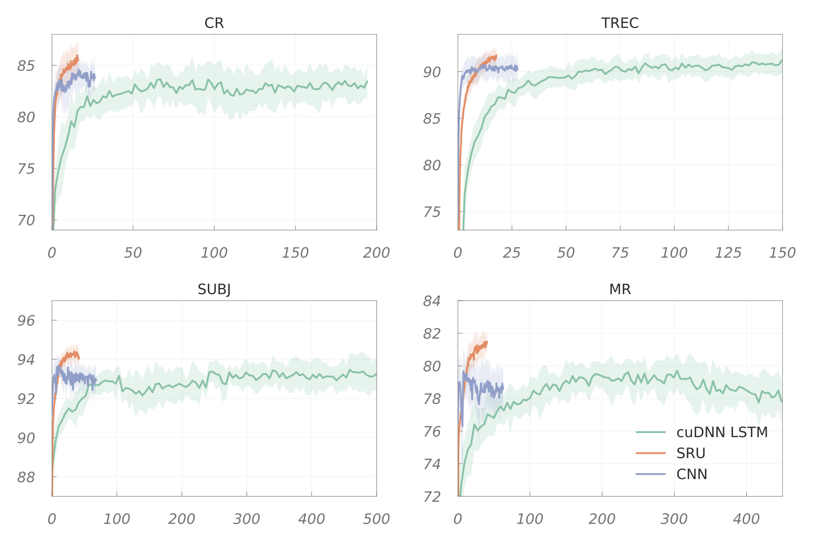

Code used for sentence classification tasks. We evaluate CNN, LSTM and SRU on 6 benchmarks. Example learning curves:

<p align="center">
<br>
<i>Training time (x-axis) vs valid accuracies (y-axis) on classification benchmarks</i><br>
</p>

## How to run
  - Download the datasets from [harvardnlp/sent-conv-torch/data](https://github.com/harvardnlp/sent-conv-torch/tree/master/data)
  
  - Download pre-trained word embeddings such as [word2vec](https://github.com/svn2github/word2vec.git); make it into text format. Follow below instructions:
  	  -  You can download bin format file of pre-trained word embeddings [GoogleNews-vectors-negative300.bin](https://www.kaggle.com/leadbest/googlenewsvectorsnegative300/version/2), it is the fastest url I've found so far. The file size is about 3.4G.
  	  -  Then make it into text format by running the python code below:
  	  
  	  ```
  	  # -*- coding: utf-8 -*-
  	  from gensim.models.keyedvectors import KeyedVectors
  	  import sys

	  model = KeyedVectors.load_word2vec_format('GoogleNews-vectors-negative300.bin', binary=True, encoding='utf-8', unicode_errors='ignore')
	  model.save_word2vec_format('google_word2vec.txt', binary=False)
  	  ```
  	  By the way, you should install python module ```gensim``` first. The output file is ```google_word2vec.txt```, and the file size is about 8.1G.
  
  - Make sure CUDA library path and `cuda_functional.py` is available to python. For example,
  ```python
    export LD_LIBRARY_PATH=/usr/local/cuda/lib64
    export PYTHONPATH=../../sru/
  ```
  
  - Run **train_classifier.py** and get the results.
  ```
    python train_classifier.py --help           # see all running options
  
    python train_classifier.py --dataset mr     # which dataset (mr, subj, cr, sst, trec, mpqa) 
          --path data_directory                 # path to the data directory
          --embedding google_word2vec.txt       # path to pre-trained embeddings
          --cv 0                                # 10-fold cross-validation, use split 0 as the test set
  ```
  
  <br>
  
  ### Credits
  
  Part of the code (such as text preprocessing) is taken from https://github.com/harvardnlp/sent-conv-torch
  
  CNN model is the implementation of [(Kim, 2014)](http://arxiv.org/abs/1408.5882), following
   - torch / lua version: https://github.com/yoonkim/CNN_sentence
   - pytorch version: https://github.com/Shawn1993/cnn-text-classification-pytorch
  
  
  
